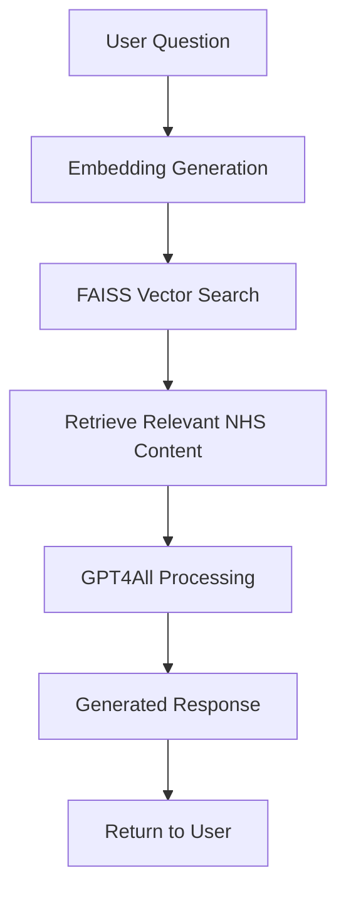

# 🏥 NHSense Bot

**An intelligent medical information chatbot powered by NHS data and RAG technology**

NHSense Bot is a sophisticated chatbot that provides reliable medical information based on the official [NHS Conditions](https://www.nhs.uk/conditions/) website. It combines **Retrieval-Augmented Generation (RAG)** with modern embedding techniques and a lightweight language model to deliver accurate, context-aware responses to medical queries.

---

## ✨ Key Features

- 🔍 **Intelligent Search**: Uses FAISS indexing for lightning-fast similarity search
- 🧠 **Local Processing**: Runs GPT4All model locally for privacy and performance
- 📊 **Rich Embeddings**: Leverages `all-MiniLM-L6-v2` for semantic understanding
- 🚀 **Fast API**: Built with FastAPI for high-performance web serving
- 📚 **Comprehensive Data**: Trained on extensive NHS conditions database

---

## 🛠️ Tech Stack

| Component | Technology |
|-----------|------------|
| **Data Source** | NHS Conditions website |
| **Embeddings** | `all-MiniLM-L6-v2` (SentenceTransformers) |
| **Vector Search** | FAISS indexing |
| **Language Model** | `gpt4all-falcon-newbpe-q4_0.gguf` |
| **API Framework** | FastAPI |
| **Data Format** | JSON |

---

## 📂 Project Architecture

### Core Components

#### 1. **`build_index.py`** - Index Builder
Creates the searchable knowledge base from NHS data.

**What it does:**
- Loads NHS dataset from `nhs_conditions_fixed.json`
- Generates semantic embeddings using `all-MiniLM-L6-v2`
- Builds optimized FAISS index for vector similarity search
- Saves processed data for runtime use

**Outputs:**
- `conditions.index` - FAISS vector index
- `condition_texts.pkl` - Serialized condition texts

**Usage:**
```bash
python build_index.py
```

#### 2. **`retrieval.py`** - Information Retrieval Engine
Handles the search and retrieval of relevant medical information.

**Key Functions:**
- Loads pre-built FAISS index and condition texts
- Encodes user queries into vector embeddings
- Performs semantic similarity search
- Returns most relevant NHS condition information

#### 3. **`gpt4all_inference.py`** - Language Generation
Powers the natural language response generation.

**Features:**
- Loads GPT4All model (`gpt4all-falcon-newbpe-q4_0.gguf`)
- Generates contextually appropriate responses
- Combines retrieved information with language understanding
- Runs entirely offline for privacy

#### 4. **`app.py`** - Web API Server
FastAPI application that ties everything together.

**Endpoints:**
- Integrates retrieval and generation systems
- Provides RESTful API for question answering
- Handles request/response formatting
- Enables easy integration with frontends

---

## 🚀 Quick Start

### Prerequisites
```bash
pip install -r requirements.txt
```

### Setup Process

1. **Build the Knowledge Index** (one-time setup):
   ```bash
   python build_index.py
   ```
   
2. **Start the API Server**:
   ```bash
   uvicorn app:app --reload
   ```

3. **Test the System**:
   Send a POST request to the API with your medical question and receive an AI-generated response based on NHS data.

---

## 🔄 How It Works



1. **Question Processing**: User submits a medical query
2. **Semantic Search**: System converts query to embeddings and searches FAISS index
3. **Context Retrieval**: Most relevant NHS condition information is retrieved
4. **Response Generation**: GPT4All generates a natural language response using retrieved context
5. **Answer Delivery**: Formatted response is returned to the user

---


## ⚠️ Important Disclaimer

> **For Educational and Informational Purposes Only**
> 
> This project is designed for educational purposes and demonstrates the application of RAG technology in healthcare information systems. The information provided by NHSense Bot:
> 
> - Is sourced from publicly available NHS website content
> - Should **never replace professional medical advice**
> - Is not intended for diagnostic purposes
> - May not reflect the most current medical guidelines
> 
> **Always consult qualified healthcare professionals for medical concerns, diagnoses, or treatment decisions.**

---

## 📄 License

This project is for educational use. Please respect the NHS terms of service and copyright when using their data.

---

## 🤝 Contributing

Contributions are welcome! Please ensure any contributions maintain the educational focus and respect medical information guidelines.

---

*Built with ❤️ for learning and healthcare accessibility*
